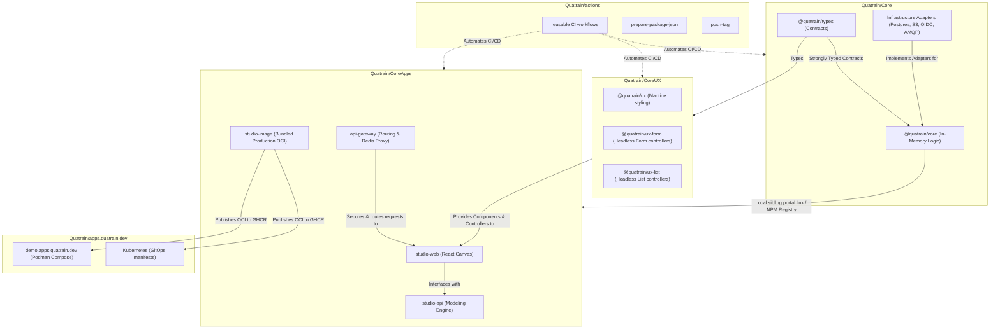

# <div align="center"><br/>The Quatrain Ecosystem</div>

<div align="center">

**"Business Logic outlives Infrastructure"**

[](https://www.gnu.org/licenses/agpl-3.0)
[](https://www.typescriptlang.org/)
[](https://bun.sh/)
[](https://podman.io/)

</div>

---

Welcome to the official repository hub of **Quatrain Technologies**. 

We build enterprise-grade, cloud-native, and highly modular frameworks designed to decouple your core business logic from transient infrastructure. Whether you are targeting strict data-sovereignty using on-premise infrastructure or scaling instantly on global Cloud/BaaS providers, Quatrain empowers you to build robust systems with **zero vendor lock-in**.

---

## 🧭 Repository Hub

The Quatrain ecosystem is organized across specialized repositories to keep concerns completely separated:

| Repository | Purpose | Primary Technologies |
| :--- | :--- | :--- |
| **[Core](https://github.com/Quatrain/Core)** | Sibling foundation library packages, adapters, and business logic frameworks. | Bun, TypeScript, PostgreSQL, SQLite, Firestore, Supabase, RabbitMQ |
| **[CoreUX](https://github.com/Quatrain/CoreUX)** | Shared UI/UX components, visual styling tokens, and framework-agnostic headless interface controllers. | React, Mantine UI, TailwindCSS, TypeScript |
| **[CoreApps](https://github.com/Quatrain/CoreApps)** | Visual designer portals, modeling API gateways, reference applications, and OCI image specifications. | React, Mantine UI, Express, Yarn Berry (v4) Workspaces, Docker/Podman |
| **[actions](https://github.com/Quatrain/actions)** | Centralized, reusable GitHub Actions mutualizing CI/CD pipelines. | GitHub Actions, Shell, Node.js |
| **[apps.quatrain.dev](https://github.com/Quatrain/apps.quatrain.dev)** | GitOps recipes, Kubernetes manifests, and Podman Compose deployment scripts. | Podman Compose, Traefik, Kubernetes |

---

## 🏗️ Architectural Topology

The following diagram illustrates how the various parts of the Quatrain ecosystem interact, from shared composite CI actions to ready-to-run container deployments:



---

## 🧠 Core Philosophy & Engineering Principles

### 1. Adapter Pattern (Decoupling)
Our core engineering philosophy is that **infrastructure changes, but business rules persist**. All database engines, authentication services, object storage providers, and message brokers are written as interchangeable adapters. You can swap an SQLite local setup for a PostgreSQL database or a Supabase Auth setup for an enterprise OIDC provider through clean, environment-driven configurations.

### 2. Sovereign & Cloud-Native
Quatrain is built from the ground up for strict data sovereignty. You can deploy the exact same application code 100% on-premise on custom virtual private clouds using open-source blocks, or on managed BaaS infrastructure without changing a single line of your domain model.

### 3. Strictly Typed Ecosystem
Every contract and interface is statically and strictly typed, ensuring total safety and self-documenting code. Standard types are separated into the `@quatrain/types` package to facilitate seamless sharing between backend services, worker runtimes, and frontend applications.

---

## 🛠️ Local Development Quickstart

To build and run the complete ecosystem locally, clone the `Core`, `CoreUX`, and `CoreApps` repositories as sibling directories:

```text
CODE/QUATRAIN/
├── Core/            # Foundation libraries & adapters
├── CoreUX/          # UI/UX elements & headless controllers
└── CoreApps/        # Dashboard interfaces & local modeling gateway
```

### 1. Setup & Link Dependencies
Navigate to the `CoreApps` repository. Because `CoreApps` uses **Yarn Berry (v4) Workspaces**, running installation will automatically resolve the `@quatrain/*` sibling dependencies from both your local `Core` and `CoreUX` directories using portal-linking:

```bash
cd CoreApps
yarn install
```

### 2. Run the Development Environment
Boot up the local modeling API and the developer studio frontend concurrently:

```bash
yarn dev
```

The Visual Developer Studio will be accessible at **`http://localhost:4000`** (or the port defined in your environment configurations).

---

## 🚀 OCI Metadata Standards
To maintain high maintainability across staging and production clusters, all our Dockerfiles/Containerfiles strictly implement the **Open Containers Initiative (OCI)** annotations:

```dockerfile
LABEL org.opencontainers.image.title="Quatrain Service"
LABEL org.opencontainers.image.source="https://github.com/Quatrain/CoreApps"
LABEL org.opencontainers.image.licenses="AGPL-3.0"
LABEL org.opencontainers.image.vendor="Quatrain Technologies"
```

---

## ⚖️ Licensing & Enterprise Services

Quatrain core repositories are open-source software licensed under the **GNU Affero General Public License v3.0 (AGPL-3.0)**. 

### Enterprise & Commercial Licenses
If your organization requires deploying Quatrain components in proprietary closed-source systems or demands custom SLAs, the **Quatrain Team** provides:
* **Commercial Exceptions**: Commercial licensing avoiding AGPL-3.0 copyleft terms.
* **Architecture Advisory**: Assistance in scaling your decoupled adapter configurations.
* **Premium Custom Adapters**: Custom integration with internal legacy enterprise systems.

For inquiries, contact us at **[developers@quatrain.com](mailto:developers@quatrain.com)**.
